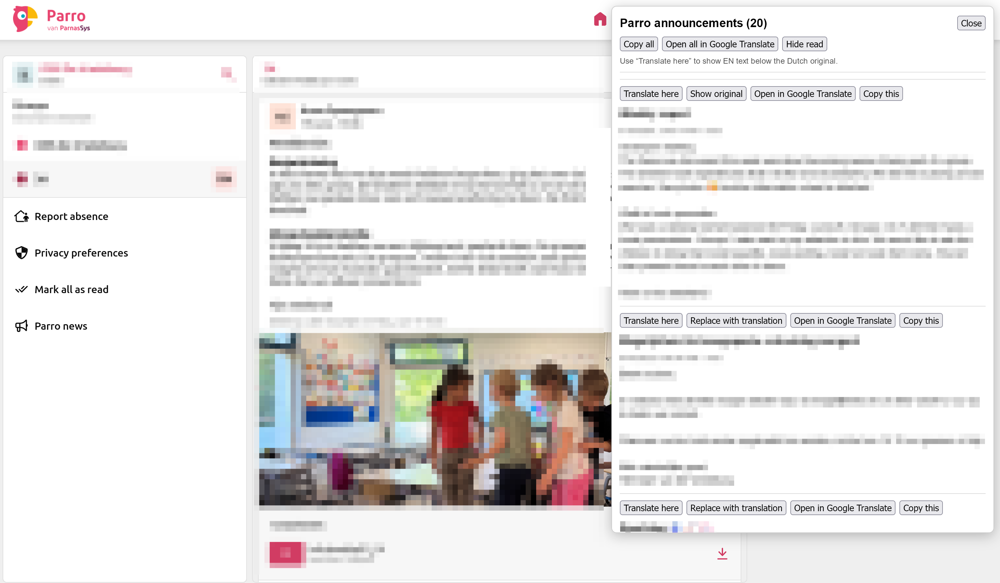

# Parro Tampermonkey Script

Parro uses Flutter Web, which renders text in a way that can break built-in browser translation and accessibility features. Browser translation has been a known Flutter Web problem for years; Flutter issue [#131984](https://github.com/flutter/flutter/issues/131984), opened on August 5, 2023, is still open.

This userscript extracts Parro news content into normal HTML and adds inline translation, making news readable in different language without relying on the browser's page translation.

Install the latest released userscript from [parro.user.js](https://github.com/librarian/tampermonkey_parro/releases/latest/download/parro.user.js).

Tampermonkey will use the script metadata `@updateURL` and `@downloadURL` to check for updates from the latest GitHub release asset.

## Installation

1. Install the Tampermonkey browser extension:
   - Chrome/Chromium/Edge: https://www.tampermonkey.net/?browser=chrome
   - Firefox: https://www.tampermonkey.net/?browser=firefox
   - Safari: https://www.tampermonkey.net/?browser=safari
2. Open the userscript install URL: [parro.user.js](https://github.com/librarian/tampermonkey_parro/releases/latest/download/parro.user.js).

3. Tampermonkey should open an installation screen. Click **Install**.
4. Open [Parro](https://talk.parro.com/) in the browser
5. Click on any news channel and it will open floating window with the same news and you can selectively translate each one.

## Usage

The overlay appears on top of Parro and contains the captured announcements as normal selectable HTML text.

Available controls:

1. **Translate to**: selects the target language. The choice is saved by Tampermonkey and reused next time.
2. **Translate here**: adds a translation below the original announcement.
3. **Replace with translation** / **Show original**: switches one announcement between translated text and the original text.
4. **Open in Google Translate**: opens the selected announcement in Google Translate.
5. **Copy this**: copies one announcement as plain text.
6. **Copy all**: copies all captured announcements as plain text.
7. **Hide read**: hides announcements that Parro marks as read.
8. **Close**: hides the overlay until announcements are opened again.

If the overlay does not appear, refresh Parro and reopen the announcements page. Tampermonkey also needs to be enabled for `talk.parro.com` and `*.parro.com`.

## Example

The userscript shows a normal HTML overlay with copy and translation controls. This anonymized screenshot has all message text and photos blurred.

## Release

Run the **Release userscript** workflow from the GitHub Actions tab.

The workflow automatically:

1. Reads `@version` from `parro.user.js`.
2. Increments the minor version, for example `0.6` to `0.7` or `1.2.3` to `1.3.0`.
3. Commits the version bump.
4. Creates and pushes the matching version tag, for example `v0.7`.
5. Creates a GitHub Release and uploads `parro.user.js` as the release asset.
